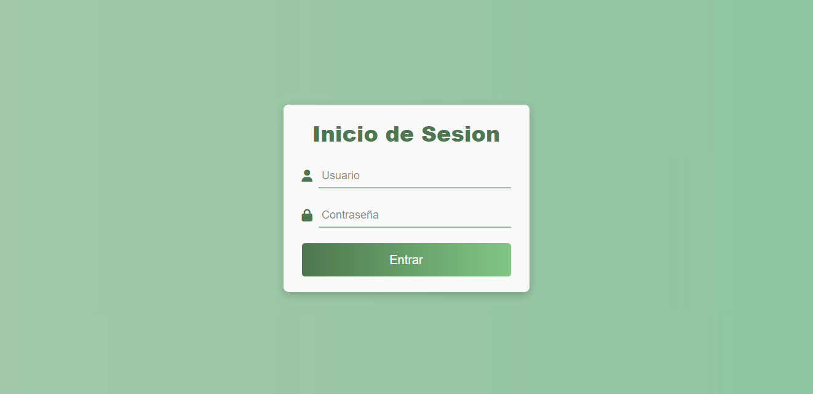
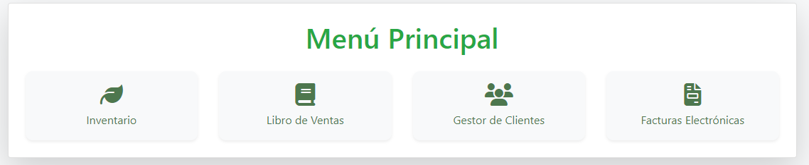
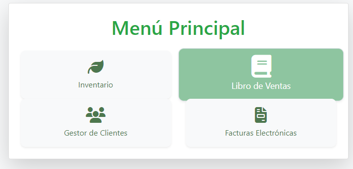

# Proyecto Naturista

Este proyecto se trata de hacer un sistema para Farmacias Naturistas en donde se podra ver el inventario disponible, ver el libro de ventas, ver los datos de los clientes que se manejan y hacer facturas electronicas. Este proyecto esta hecho con HTML, CSS y JavaScript. Ademas la pagina esta conectada a una base de datos. 

## Configuracion del proyecto

## Modelo Entidad-Relacion

## Captura de pantalla

### Login

### Menu

### Menu Animacion

